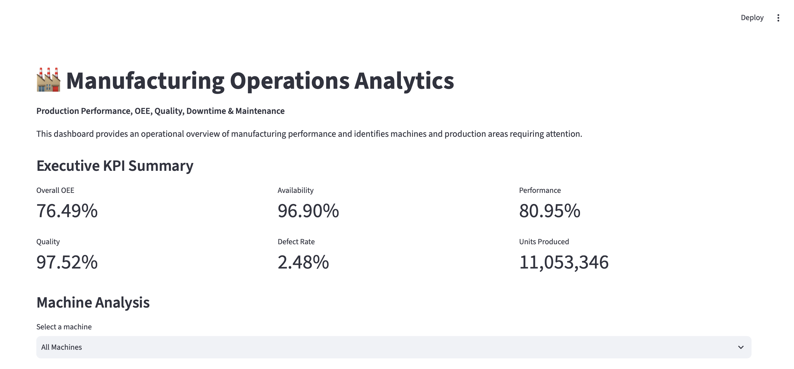
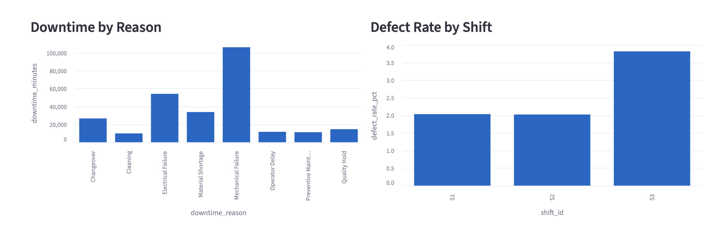
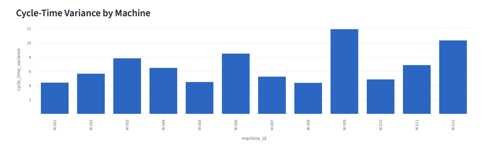
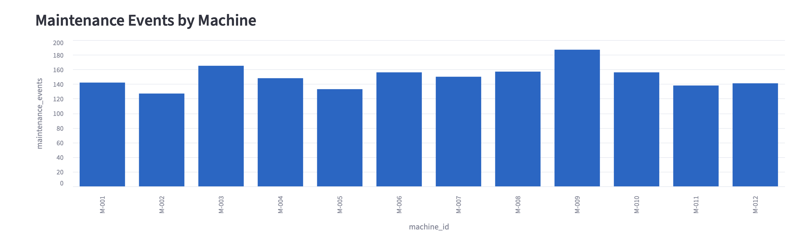
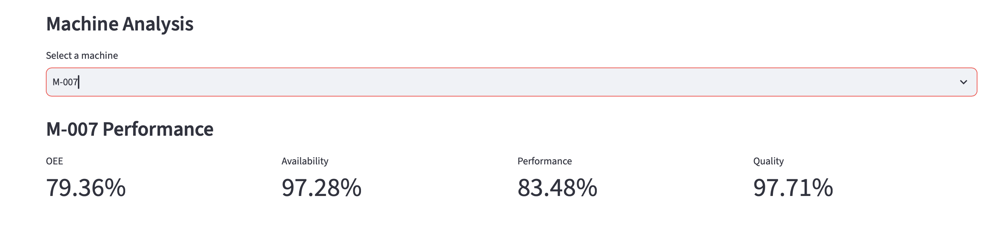

# Manufacturing Operations Analytics

## Overview

Manufacturing Operations Analytics is an end-to-end data analytics project focused on evaluating production performance, equipment efficiency, quality, downtime, maintenance activity, and machine-level operational performance.

The project uses manufacturing production data to calculate key operational KPIs, including Overall Equipment Effectiveness (OEE), availability, performance, quality, defect rate, downtime, and cycle-time variance.

An interactive Streamlit dashboard was developed to transform the analysis into a business-facing reporting tool for identifying underperforming machines and operational improvement opportunities.

---

## Business Problem

Manufacturing operations generate large volumes of production, downtime, quality, and maintenance data. Without structured analysis, it can be difficult to identify:

- Which machines are underperforming
- Which downtime causes have the greatest operational impact
- Which production shifts have higher defect rates
- Which machines have excessive cycle-time variance
- Which machines require maintenance attention
- Where operational improvements should be prioritized

This project addresses these questions through data cleaning, exploratory analysis, KPI development, OEE analysis, correlation analysis, and interactive dashboard reporting.

---

## Key Questions

The analysis focuses on the following business questions:

1. What is the overall manufacturing OEE?
2. Which machines have the lowest OEE?
3. What are the primary causes of production downtime?
4. Which production shift has the highest defect rate?
5. Which machines have the highest cycle-time variance?
6. How are downtime and maintenance activity associated with machine performance?
7. Which machines should be prioritized for operational improvement?

---

## Tools & Technologies

- Python
- Pandas
- NumPy
- Matplotlib
- Seaborn
- Streamlit
- SQL concepts
- Git / GitHub
- CSV data processing
- Exploratory Data Analysis
- KPI Analysis
- OEE Analysis
- Data Visualization

---

## Project Workflow

The project follows an end-to-end analytics workflow:

Raw Manufacturing Data
        ↓
Data Cleaning & Validation
        ↓
Exploratory Data Analysis
        ↓
KPI Calculation
        ↓
OEE Analysis
        ↓
Machine Performance Analysis
        ↓
Correlation Analysis
        ↓
Dashboard Dataset Creation
        ↓
Interactive Streamlit Dashboard
        ↓
Business Insights

---

## Dataset

The project uses generated manufacturing operational data representing production activity across multiple machines, shifts, operators, and product types.

The data includes information related to:

- Production volume
- Good units
- Defective units
- Machine IDs
- Downtime
- Downtime reasons
- Maintenance events
- Production shifts
- Operators
- Product types
- Ideal cycle time
- Actual cycle time

The dataset is intended for portfolio and analytical demonstration purposes.

---

## Key KPIs

The analysis calculates the following manufacturing KPIs:

### Overall Equipment Effectiveness (OEE)

OEE combines:

- Availability
- Performance
- Quality

The project calculates an overall OEE of approximately:

**76.49%**

### Availability

**96.90%**

### Performance

**80.95%**

### Quality

**97.52%**

### Defect Rate

**2.48%**

### Total Units Produced

**11,053,346 units**

### Total Downtime

Approximately:

**268,083 minutes**

---

## Key Findings

### Machine Performance

The lowest-performing machine was:

**M-009**

with an OEE of approximately:

**66.88%**

M-012 was the second-lowest-performing machine with an OEE of approximately 69.28%.

These machines represent potential priorities for further operational investigation.

### Downtime

The largest contributor to downtime was:

**Mechanical Failure**

accounting for approximately:

**39.64% of total downtime**

Electrical failures were the second-largest contributor at approximately 20.20%.

### Quality

The highest defect rate occurred during:

**Shift S3**

with a defect rate of approximately:

**3.82%**

This is substantially higher than the defect rates observed in S1 and S2.

### Cycle Time

The machine with the highest cycle-time variance was:

**M-009**

with a variance of approximately:

**11.88 seconds**

This indicates a significant difference between ideal and actual cycle time.

---

## OEE Analysis

Machine-level OEE analysis identified substantial differences in performance across the manufacturing operation.

The lowest OEE machines were:

| Machine | OEE |
|---|---:|
| M-009 | 66.88% |
| M-012 | 69.28% |
| M-006 | 73.43% |
| M-003 | 74.41% |
| M-011 | 75.92% |

These machines were included in the dashboard's priority analysis.

---

## Dashboard

The project includes an interactive Streamlit dashboard providing:

- Executive KPI summary
- Overall OEE
- Availability
- Performance
- Quality
- Defect rate
- Production volume
- OEE by machine
- Downtime by reason
- Defect rate by shift
- Cycle-time variance
- Maintenance events
- Machine priority analysis
- Machine-level performance filtering
- Automated key operational findings


### Dashboard Preview

#### Executive Dashboard



#### Operational Analysis





#### Machine-Level Analysis




To launch the dashboard locally:

```bash
streamlit run dashboard/app.py
Then open:
http://localhost:8501

Project Structure
manufacturing-operations-analytics/
│
├── data/
│   ├── raw/
│   └── processed/
│
├── scripts/
│   ├── data_exploration.py
│   ├── eda.py
│   ├── oee_analysis.py
│   └── dashboard_data.py
│
├── dashboard/
│   ├── app.py
│   └── app_step12_backup.py
│
├── README.md
├── requirements.txt
└── .gitignore


Analytical Insights

The analysis suggests several areas that could be investigated further:

- Mechanical failures are the largest source of downtime.
- M-009 has the lowest OEE and highest cycle-time variance.
- M-012 also demonstrates relatively low OEE.
- S3 has the highest defect rate and may require additional quality investigation.
- Cycle-time performance appears strongly associated with machine-level OEE in this dataset.
- Maintenance activity should be evaluated alongside downtime and machine performance before determining operational interventions.

Correlation results should be interpreted as associations rather than evidence of causation.


Limitations

This project uses generated manufacturing data for portfolio purposes.

The OEE calculation uses documented assumptions regarding planned production time and shift duration. In a real manufacturing environment, OEE calculations would ideally incorporate actual machine schedules, planned downtime, production runs, shift calendars, and equipment-specific operating conditions.

Correlation analysis also identifies relationships between variables but does not establish causation.


Future Improvements

Potential future improvements include:

- Adding date-range filtering
- Adding product-level analysis
- Adding shift-level production volume analysis
- Adding predictive maintenance analysis
- Developing downtime forecasting
- Adding machine-level drill-down views
- Connecting the dashboard to live manufacturing data

Author

Data Analytics Portfolio Project

Focus: Data Analysis | Manufacturing Analytics | Operations Analytics | Business Intelligence
